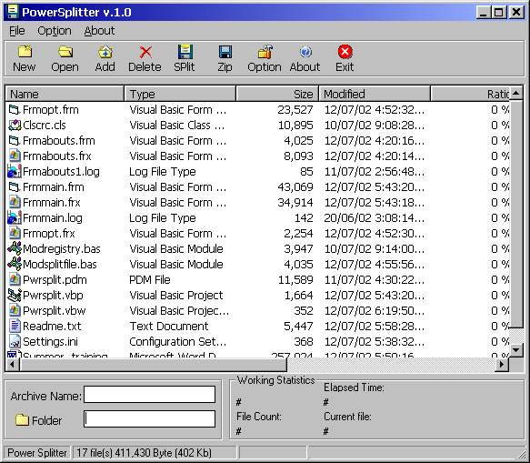



## Splitting With Compression

### Description

PowerSplitter is the program for splitting with "Compression" of huge files to the parts of required size and combining back all that you have split withoptions . It is suitable solution if you're dealing with

floppies (and superfloppies) and large packages often. This means that

you use this program and freely modified it. But Please,Please tell me before doing it.please Report Me any Bug.....to me at.

please rate this Project .............
 
### More Info
 
Key features

----

1) One can compress (with the help of "Zlib.dll" library) larger files to small ones

before splitting. With level compression from (1 to 9) .1 being the almost no compression

and which is very fast on the other hand the 9 being the slowest compression and yield a

good compression.But here i have used limited level.

2) Multiple files handling. Multiple files can be split to one set of volume( with Compression)

To Separate files to binary chunks and Self-joining volumes.

3) There is an extra file .000. Which contain information about the spited files.

.000 file contain header and files (name,type,size,compressed Size,CRC etc.) info.......

4) Binary splitting. It can produce binary chunks of original file for Later recombining

on non-Windows machine (DOS, Unix or Mac). The Power Splitter generates the batch file to

restore original in DOS. This file is able to restore files from any removable media as well

As from hard disk.

5) Variable split sizes. (Splits in Segments options.)

6) Source and destination redirection. Very useful for splitting/combining files to/from

different kinds of media or to/from different folders.

7) Default directories for split and combine.

8) File removal after successful (Orignal) split operation and (Split) join operation.

9) Auto-launching of combined files.

10) Check the File CRC (cyclic redundancy check). Here is have used 32 bit CRC check which isvery fast. One can also use CRC 8,16.

11) Run program from with in.... (new)

split and compressed files

Key features

----

1) One can compress (with the help of "Zlib.dll" library) larger files to small ones

before splitting. With level compression from (1 to 9) .1 being the almost no compression

and which is very fast on the other hand the 9 being the slowest compression and yield a

good compression.But here i have used limited level.

2) Multiple files handling. Multiple files can be split to one set of volume( with Compression)

To Separate files to binary chunks and Self-joining volumes.

3) There is an extra file .000. Which contain information about the spited files.

.000 file contain header and files (name,type,size,compressed Size,CRC etc.) info.......

4) Binary splitting. It can produce binary chunks of original file for Later recombining

on non-Windows machine (DOS, Unix or Mac). The Power Splitter generates the batch file to

restore original in DOS. This file is able to restore files from any removable media as well

As from hard disk.

5) Variable split sizes. (Splits in Segments options.)

6) Source and destination redirection. Very useful for splitting/combining files to/from

different kinds of media or to/from different folders.

7) Default directories for split and combine.

8) File removal after successful (Orignal) split operation and (Split) join operation.

9) Auto-launching of combined files.

10) Check the File CRC (cyclic redundancy check). Here is have used 32 bit CRC check which isvery fast. One can also use CRC 8,16.

11) Run program from with in.... (new)

yet not.......

             |
---                |---
**Submitted On**   |2002-07-12 05:58:28
**By**             |[dheeraj khajuria](https://github.com/Planet-Source-Code/PSCIndex/blob/master/ByAuthor/dheeraj-khajuria.md)
**Level**          |Intermediate
**User Rating**    |4.7 (33 globes from 7 users)
**Compatibility**  |VB 6\.0
**Category**       |[Files/ File Controls/ Input/ Output](https://github.com/Planet-Source-Code/PSCIndex/blob/master/ByCategory/files-file-controls-input-output__1-3.md)
**World**          |[Visual Basic](https://github.com/Planet-Source-Code/PSCIndex/blob/master/ByWorld/visual-basic.md)
**Archive File**   |[file\_Split1051847112002\.zip](https://github.com/Planet-Source-Code/dheeraj-khajuria-splitting-with-compression__1-36774/archive/master.zip)

### API Declarations

lot of api are used

